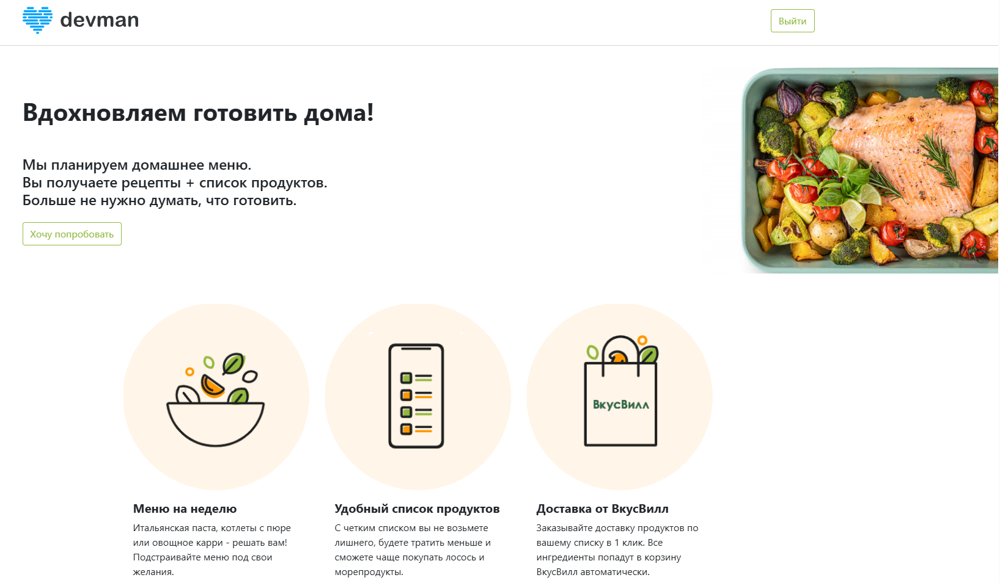
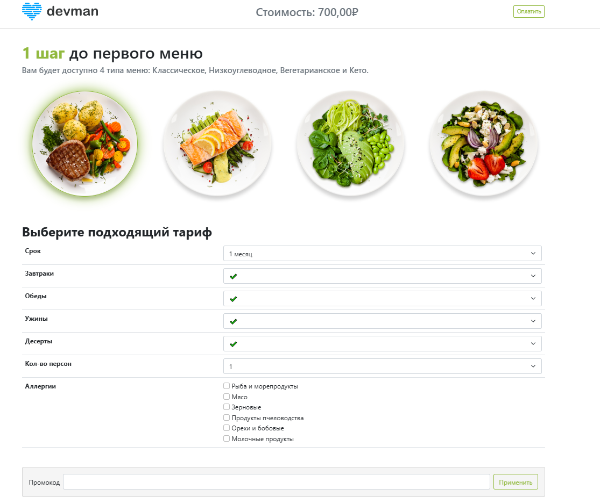
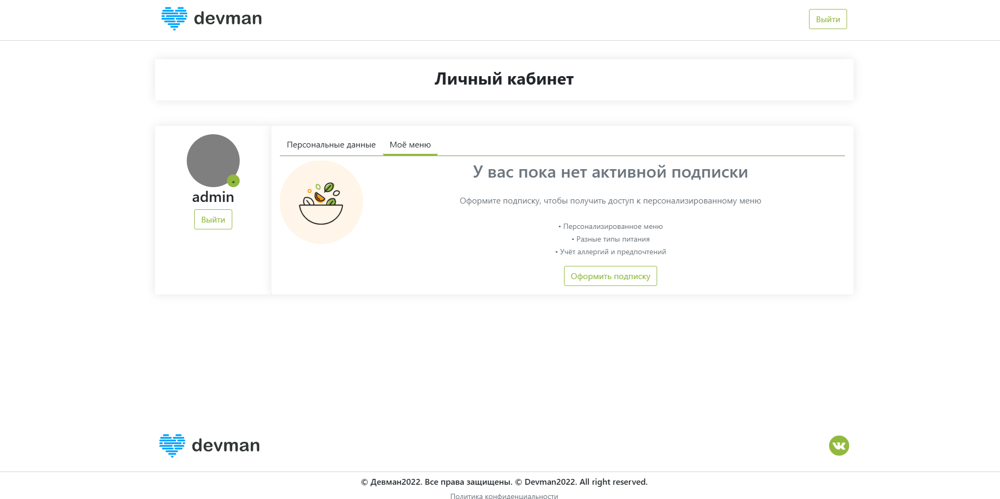
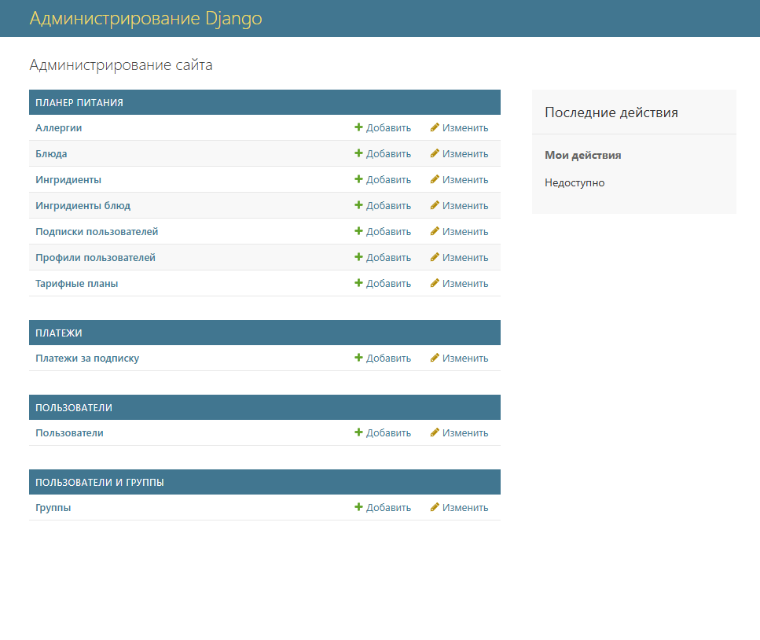

# Сервис FoodPlan

Сервис для получения рецептов на день по подписке в зависимости от выбранной диеты (классическая, кето, вегетарианская, низкоуглеводная), количества приемов пищи (завтрак, обед, ужин, десерт), количества персон. После выбора меню сервис автоматически рассчитывает необходимое количество продуктов, калорийность, подбирает блюда в зависимоти от выбранной диеты.



---

## На сайте есть два независимых интерфейса.

__Первый интерфейс__ - часть которую видит пользователь, здесь можно прочитать информацию о проекте, зарегистрироваться и оформить подписку.

**Главная страница сайта:**


**Страница оформления подписки:**



**Личный кабинет:**



__Второй интерфейс__ - админ панель. Сюда заходит менеджер, чтобы добавить блюдо, ингредиенты, убрать блюдо из выдачи.



---

## Переменные окружения

Часть настроек проекта берётся из переменных окружения. Чтобы их определить, создайте файл `.env` в каталге проекта рядом с файлом `manage.py` и запишите туда данные в таком формате: `ПЕРЕМЕННАЯ=значение`.

```sh
SECRET_KEY=django_secret_key (Секретный [ключ](https://docs.djangoproject.com/en/5.2/ref/settings/#secret-key) приложения Django)
ALLOWED_HOSTS =127.0.0.1 (Допустимые [хосты](https://docs.djangoproject.com/en/5.2/ref/settings/#allowed-hosts) для приложения Django)
DEBUG = FALSE ([Дебаг](https://docs.djangoproject.com/en/5.2/ref/settings/#debug) режим приложения Django)
YOOKASSA_SHOP_ID=ID сервиса оплаты ЮКасса
YOOKASSA_SECRET_KEY=Секретный ключ сервиса оплаты ЮКасса
```

---

## Как запустить

Для запуска сайта понадобится python версии 3 (проект разрабатывался на версии python 3.13.5)

Скачайте код с Githib

Установите переменное окружение

```sh
python -m venv venv
```

Активируйте переменное окружение

linux
```sh
source venv/bin/activate
```

Windows
```sh
./venv/Scripts/activate
```

Установите зависимости

```sh
pip install -r requirements.txt
```

Выполните создание базы данных

```sh
python manage.py createsuperuser
```

Выполните миграции

```sh
python manage.py makemigrations
```

```sh
python manage.py migrate
```

Запустите отладочный сервер

```sh
python manage.py runserver
```

Перейдите на сервер по адресу `http://127.0.0.1:8000/`

Перейдите в админ-панель `http://127.0.0.1:8000/admin`, создайте блюда и игредиенты

## Переменные окружения

Часть настроек проекта берётся из переменных окружения. Чтобы их определить, создайте файл `.env` в каталге проекта рядом с файлом `manage.py` и запишите туда данные в таком формате: `ПЕРЕМЕННАЯ=значение`.

```sh
SECRET_KEY=django_secret_key (Секретный [ключ](https://docs.djangoproject.com/en/5.2/ref/settings/#secret-key) приложения Django)
ALLOWED_HOSTS =127.0.0.1 (Допустимые [хосты](https://docs.djangoproject.com/en/5.2/ref/settings/#allowed-hosts) для приложения Django)
DEBUG = FALSE ([Дебаг](https://docs.djangoproject.com/en/5.2/ref/settings/#debug) режим приложения Django)
YOOKASSA_SHOP_ID=ID сервиса оплаты ЮКасса
YOOKASSA_SECRET_KEY=Секретный ключ сервиса оплаты ЮКасса
```

---
## Цели проекта

Код написан в учебных целях — это урок в курсе по Python и веб-разработке на сайте [Devman](https://dvmn.org).

